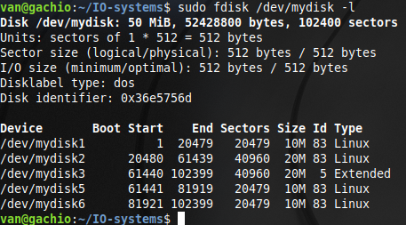
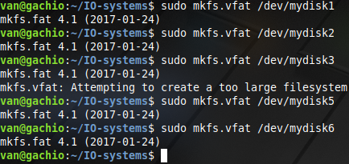
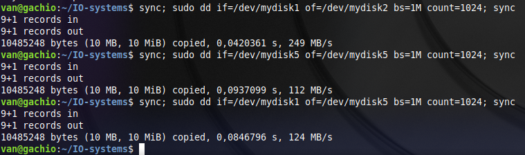
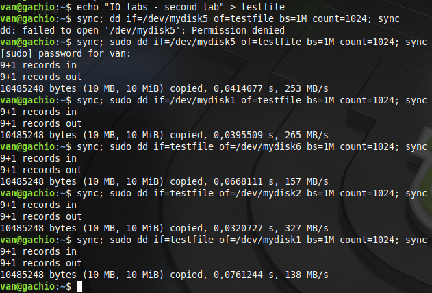

# Лабораторная работа 2

**Название:** "Разработка драйверов блочных устройств"

**Цель работы:** Получить знания и навыки разработки драйверов блочных устройств для операционной системы Linux.

## Описание функциональности драйвера

Создается два первичных раздела и один расширенный с размерами 10, 20 и 20 Мб соотвественно. Расширенный разделяется на два логических раздела, оба размером 10 Мб.

## Инструкция по сборке

```bash
make
```

## Инструкция пользователя

```bash
insmod block_device_driver.ko
```

## Примеры использования

Пример просмотра разделов диска:



Пример создания файловых систем, на созданном диске:



Пример записи с виртуального диска на виртуальный диск с подсчетом времени:



Пример записи и чтения с виртуального диска на физический с подсчетом времени:


