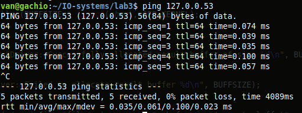

# Лабораторная работа 3

**Название:** "Разработка драйверов сетевых устройств"

**Цель работы:** получить знания и навыки разработки драйверов сетевых интерфейсов для операционной системы Linux.

## Описание функциональности драйвера


Драйвер должен создавать виртуальный сетевой интерфейс в ОС Linux.
Созданный сетевой интерфейс должен перехватывать пакеты родительского интерфейса (eth0 или другого).
Сетевой интерфейс должен реализовывать логику работы с перехваченным трафиком:
 - Пакеты протокола IPv4, адресуемые конкретному IP. Вывести IP адреса отправителя и получателя.
 - Состояние разбора пакетов необходимо выводить в файл в директории /proc
Должна иметься возможность просмотра статистики работы созданного интерфейса.

## Инструкция по сборке

```bash
git clone https://github.com/salvoronis/IO-systems.git
cd IO-systems/lab3
make
```

## Инструкция пользователя

Для загрузки модуля после сборки
```bash
sudo insmod network_driver.ko
```

Проверка кольцевого буфера
```bash
dmesg -w
```

Проверка /proc/var2data
```bash
cat /proc/var2data
```

Выгрузка модуля
```bash
sudo rmmod network_driver
```
## Примеры использования

Для тестирования конкретного IPv4 (127.0.0.53)
```bash
ping 127.0.0.53
```



Вывод dmesg


Информация о состоянии разбора пакетов

